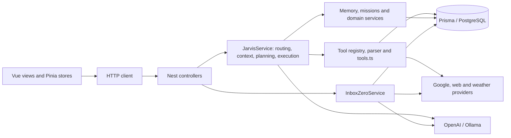

# Jarvis codebase and launch-readiness audit

Date: 21 September 2026 · Baseline commit: `26a490e` · Target: private beta for individual users, confirmed by the owner.

## Verdict

**Jarvis is a substantial functional prototype, but it is not ready to host other people's private data.** The main blockers are authentication and ownership, unsafe HTML rendering, insufficient protection around outbound web requests, and unreliable recovery after external actions. A visual redesign alone would leave these risks intact.

Retain Vue, Pinia, NestJS, Prisma, PostgreSQL, the provider interfaces, and the useful existing tests. Rework the product and execution boundaries incrementally. There is no evidence that a framework replacement or microservices would solve the actual problems.

This audit made no application-source changes, migrations, external account changes, or live email/calendar mutations. Dependencies were installed from the lockfiles with installation scripts disabled; Prisma Client was generated explicitly. Existing untracked `notes/` content was preserved.

## Scope and confidence

Reviewed application entry points, every HTTP controller, data models, authentication/integration flow, action confirmation, Inbox Zero execution, provider boundaries, representative domain services, frontend routes/stores/components, migrations and available quality/deployment configuration. Inspected the running desktop chat and Inbox Zero screens and dashboard accessibility state with the API unavailable.

This is an architectural and risk-focused repository audit, not a claim that every branch has been exhaustively reviewed or penetration-tested. Distinguish:

- **Verified:** build/test/lint results, rendered UI observations, and isolated probes described below.
- **Code-confirmed:** implementation defects visible in the cited paths, without exercising real accounts.
- **Unverified:** production infrastructure, real OAuth and provider behavior, migrations against PostgreSQL, mobile/screen-reader behavior, and dependency vulnerabilities.

## Current architecture

The UI provides Chat, Dashboard, Inbox Zero and Settings. The backend additionally implements tasks, notes, shopping, memory, missions, goals, habits, reminders, contacts, finance, knowledge, delegation and analytics. This breadth exceeds the product experience and verified behavior available for a first release.

Useful foundations include DTO validation on body-based endpoints, explicit tool metadata, confirmation previews, Google scope gates, provider interfaces, bounded concurrency in Inbox Zero, persisted action audit records, lazy-loaded frontend routes, and reusable inputs with label/error associations.

The main concentration points are `jarvis.service.ts` (4,038 lines), `tools.ts` (5,932 lines), and `tool-call.ts` (1,572 lines). This is more than a file-size issue: planning, policy, presentation, persistence and side effects are interwoven, and tool definitions span several manually synchronized representations.

## Verified baseline

Environment: Node `24.11.0`, npm `11.6.1`. These are the audit environment versions, not a declared project support policy.

| Check | Result |
|---|---|
| Frontend `npm run typecheck` | Passed |
| Frontend `npm run build` | Passed; 83 modules transformed |
| Prisma Client generation | Passed using a local cached schema engine copied to a temporary writable path |
| Prisma schema validation | Passed; does not validate migration replay or database contents |
| API `npm run build` | Passed |
| API `npm test -- --runInBand --coverage` | 23 suites passed, 1 failed; 96 tests passed, 2 failed |
| Backend coverage from that run | Statements 33.12%; branches 26.58%; functions 36.20%; lines 35.02% |
| Non-mutating ESLint over API source and tests | 1,690 errors, 68 warnings across 100 files |
| Lint split | Application source: 1,415 errors / 41 warnings; tests: 275 / 27 |
| Frontend automated tests/lint | No corresponding scripts or test suite found |
| Browser review | Desktop shell and API-unavailable states inspected; connected flows not verified |
| Database migration and integration checks | Not run: Docker daemon unavailable and no local PostgreSQL executable found |
| Existing API end-to-end suite | Inspected, not run; only checks `GET /` → `Hello World!`, loads the real AppModule and does not close the app |
| Dependency advisory checks | Unverified: sandbox network request failed; escalation was rejected by automatic approval review because it would transmit dependency metadata to npm |

The first lint run happened before Prisma generation and produced inflated counts; only the regenerated-client result above is the baseline. Do not run the current `npm run lint` during an audit expecting a read-only check: its script includes `--fix`.

The two failing tests are in [jarvis.service.spec.ts](/Users/celian/Documents/jarvis-ai/api/src/jarvis/services/jarvis.service.spec.ts:632): ambiguous calendar deletion and missing calendar-write scope. Both fail because the LLM mock was called despite an expectation of zero calls. This establishes a routing/test-contract mismatch; it does **not** establish that a real unauthorized calendar write occurred. Investigate before changing either expectation.

Coverage is particularly weak around effects: InboxZeroService has 0/303 covered statements, PendingActionsService 8/67, and tools.ts 786/2,308. Prioritize meaningful integration and failure-path coverage over a blanket percentage target.

## Findings, ordered by launch risk

P0 = blocks any shared beta containing real user data. P1 = fix before opening the affected beta feature. P2 = planned product/maintainability improvement. Severity is scoped to the intended deployment, not a formal vulnerability score.

### A01 · P0 · Client-controlled identity and missing data ownership

**Evidence:** [Jarvis controller](/Users/celian/Documents/jarvis-ai/api/src/jarvis/jarvis.controller.ts:7), [Google controller](/Users/celian/Documents/jarvis-ai/api/src/google/google-auth.controller.ts:5), [Inbox Zero controller](/Users/celian/Documents/jarvis-ai/api/src/inbox-zero/inbox-zero.controller.ts:10), [schema](/Users/celian/Documents/jarvis-ai/api/prisma/schema.prisma:9), [frontend default identity](/Users/celian/Documents/jarvis-ai/web/src/core/config/env.ts:15).

There is no application authentication guard. Requests select identity using body/query `sessionId`, defaulting to the shared string `default`. Settings explicitly lets users edit this identifier; the optional bearer token is sent by the client but is not verified by the server. Knowing or choosing a session ID grants access to that session's context and linked integrations.

Todo, Note, ShoppingItem and CalendarEvent have no owner/session column. Queries and dashboard counts span all rows. DbCalendarProvider explicitly ignores its session argument. Even perfect authentication on the routes would not isolate these records.

Additional ownership defects exist in nominally scoped services: [reminder snooze](/Users/celian/Documents/jarvis-ai/api/src/jarvis/services/jarvis-reminder.service.ts:75) updates only by ID; [goal status update and hierarchy](/Users/celian/Documents/jarvis-ai/api/src/jarvis/services/jarvis-goal.service.ts:118) omit ownership predicates. These service contracts must be safe independently of how the UI selects objects.

**Required:** authenticated server-derived user identity, separate conversation IDs, ownership on every private record, owner-scoped reads/writes/search/counts/undo, and two-user isolation tests. Existing ownerless records require an explicit migration mapping; do not assign them to whichever user logs in first.

### A02 · P0 · Unsafe HTML rendering in assistant and OAuth surfaces

**Evidence:** [Markdown renderer](/Users/celian/Documents/jarvis-ai/web/src/shared/utils/markdown.ts:1), [v-html sink](/Users/celian/Documents/jarvis-ai/web/src/features/chat/components/ChatMessageItem.vue:105), [OAuth callback HTML](/Users/celian/Documents/jarvis-ai/api/src/google/google-auth.controller.ts:17).

Assistant Markdown is parsed without sanitization, then injected into the DOM. An isolated probe of the actual renderer confirmed that `` retains its event handler. The custom link renderer also interpolates URLs directly. Model output can incorporate untrusted web/email material; it is not trusted HTML. The OAuth callback interpolates the user-selected session string into HTML without escaping after a successful exchange.

**Required:** safe Markdown/HTML policy, sanitization and allowed link protocols, safe fallback rendering, a fixed OAuth return page without reflected identity markup, and regression tests for HTML, attribute and URL attacks. Add browser security headers as defense in depth.

### A03 · P0 · Outbound web access can reach internal addresses

**Evidence:** [URL validation](/Users/celian/Documents/jarvis-ai/api/src/jarvis/providers/web.provider.ts:108), [open](/Users/celian/Documents/jarvis-ai/api/src/jarvis/providers/web.provider.ts:230), [fetch timeout](/Users/celian/Documents/jarvis-ai/api/src/jarvis/providers/web.provider.ts:518).

Validation checks the literal hostname only, never resolved addresses. Fetch follows redirects by default without validating the destination. An isolated probe with a mocked fetch confirmed that `http://[::1]/` passes validation: URL hostname brackets prevent the current IPv6 checks from recognizing it. No internal endpoint was contacted during the probe.

Response content is fully buffered before truncation, and the web timeout is cleared when fetch returns headers rather than when body reading ends. A hostile response can therefore exceed the intended memory/time budget.

**Required:** robust address parsing, resolved-address checks bound to the actual connection, redirect validation or disabled redirects, egress restrictions, response byte limits, and an end-to-end request deadline. This follows the relevant [OWASP SSRF guidance](https://cheatsheetseries.owasp.org/cheatsheets/Server_Side_Request_Forgery_Prevention_Cheat_Sheet.html). Disable web opening for the beta until these controls pass tests.

### A04 · P1 · Email execution does not survive retries or partial failure safely

**Evidence:** [Inbox Zero apply](/Users/celian/Documents/jarvis-ai/api/src/inbox-zero/inbox-zero.service.ts:432), especially the send at line 632 followed by label updates and database persistence.

The API sends a reply, then updates labels, then updates local state. A failure after the send is returned as a failed item. Retrying can send the reply again. There is no request idempotency key, durable step journal, or reconciliation for an uncertain provider result. Creating a reminder followed by a failed Gmail update has a similar partial-success problem.

Inbox Zero calls providers directly, bypassing the chat action policy, preview/audit mechanism and simulation switch. A visible chat simulation setting therefore does not describe all application effects. User confirmation in the UI cannot replace server-enforced execution policy.

**Required:** shared command lifecycle across chat and UI, durable request IDs and per-item outcomes, policy enforcement, safe retry rules, and reconciliation. Do not claim exactly-once external effects: a provider timeout may leave the outcome unknown. Never automatically resend an unknown-outcome email.

### A05 · P1 · Pending confirmations are deleted before execution is durable

**Evidence:** [pending consume](/Users/celian/Documents/jarvis-ai/api/src/jarvis/services/pending-action.service.ts:134), [confirmation execution](/Users/celian/Documents/jarvis-ai/api/src/jarvis/services/jarvis.service.ts:3873).

Read and delete are separate operations; the pending record disappears before the external action executes. A crash between deletion and execution loses the intent. Concurrent consumption can produce a delete error rather than a stable replay result. Expiry deletion has a related read/delete race. Session matching for confirmation is optional by default.

**Required:** atomic claim with expiry/owner predicates and explicit states: proposed, awaiting confirmation, executing, succeeded, failed, cancelled, expired, outcome unknown. Bind approval to immutable arguments/targets and return the existing operation state on replay.

### A06 · P1 · Integration credentials and private content lack a full lifecycle

**Evidence:** [token schema](/Users/celian/Documents/jarvis-ai/api/prisma/schema.prisma:62), [token persistence](/Users/celian/Documents/jarvis-ai/api/src/google/google-auth.service.ts:65), [OAuth state store](/Users/celian/Documents/jarvis-ai/api/src/google/oauth-state.service.ts:8), [logs](/Users/celian/Documents/jarvis-ai/api/src/jarvis/services/jarvis.service.ts:1510), [email drafting prompt](/Users/celian/Documents/jarvis-ai/api/src/inbox-zero/inbox-zero.service.ts:903).

OAuth tokens are persisted without application-level encryption. Raw user messages, model output, tool arguments and results can be logged; email content is sent to the configured model for drafting. No complete export/delete/retention/revocation flow was found. Infrastructure encryption and vendor account policies are unknown. OAuth state has TTL/single-use handling, but lives in one process and is bound to a caller-selected session rather than an authenticated account.

**Required:** encrypted token storage with a managed key, authenticated OAuth binding, minimal scopes, reconnect/revoke behavior, explicit data-flow disclosure, retention/redaction and account deletion including backups/provider disconnect behavior. Verify the beta's applicable Google verification requirements early: the requested Gmail scopes include restricted scopes, and server storage/transmission can trigger assessment requirements. [Google scope guidance](https://developers.google.com/workspace/gmail/api/auth/scopes), [verification requirements and exceptions](https://developers.google.com/identity/protocols/oauth2/production-readiness/restricted-scope-verification).

### A07 · P1 · Incomplete deployment and abuse-control boundary

**Evidence:** [bootstrap](/Users/celian/Documents/jarvis-ai/api/src/main.ts:7), [DTO](/Users/celian/Documents/jarvis-ai/api/src/jarvis/dto/chat.dto.ts:1), [Inbox apply DTO](/Users/celian/Documents/jarvis-ai/api/src/inbox-zero/dto/inbox-zero-apply.dto.ts:18), [compose](/Users/celian/Documents/jarvis-ai/docker-compose.yml:1).

CORS is unrestricted; the developer UI is always served. No authentication/rate-limit middleware, explicit security-header configuration, per-user model budget or batch-size maximum was found. Query parameters do not receive the same DTO validation as bodies. Configuration is read in several places without one startup schema. Docker Compose only supplies a development database with a published port and a sample password. No repository CI/deploy workflow, readiness check or restore runbook was found; external infrastructure may exist but was not inspected.

**Required:** production configuration validation, authenticated quotas, request/batch limits, origin policy, production-disabled developer assets, health/readiness, request correlation, redacted operational logs, reproducible builds and deployment/backup/rollback procedures.

### A08 · P1 · Cancellation, account changes and persistence are inconsistent

**Evidence:** [chat store](/Users/celian/Documents/jarvis-ai/web/src/stores/chatStore.ts:61), [API wrapper](/Users/celian/Documents/jarvis-ai/web/src/core/api/jarvis.ts:18), [app store](/Users/celian/Documents/jarvis-ai/web/src/stores/appStore.ts:25), [status store](/Users/celian/Documents/jarvis-ai/web/src/stores/statusStore.ts:20).

The chat store creates an AbortController but never passes its signal to the request. Stop/reset changes UI state without cancelling the request; a late response can repopulate cleared history. Chat, status and inbox stores are not comprehensively invalidated on identity change. Chat history is browser-memory-only, while server conversations/tool references also rely on process memory. OAuth connect URLs ignore the configured remote API base URL.

**Required:** account-scoped state, request generation guards, signal propagation, persisted conversation/history endpoints, explicit cancellation semantics, and one URL builder. Distinguish cancelling a response from cancelling a command that may already have executed.

### A09 · P1 · Errors are presented as empty or successful states

**Evidence:** [dashboard](/Users/celian/Documents/jarvis-ai/web/src/views/DashboardView.vue:1), [Inbox Zero defaults](/Users/celian/Documents/jarvis-ai/web/src/views/InboxZeroView.vue:24), [reminder service](/Users/celian/Documents/jarvis-ai/api/src/jarvis/services/jarvis-reminder.service.ts:41).

The browser review with the API unavailable showed the dashboard saying there were no urgent suggestions and no reminders/habits, and Inbox Zero saying Gmail was disconnected while showing three HTTP 500 toasts. Those connection/empty claims were not known. Several backend services catch database errors and return `[]`, `null` or `false`, making outages indistinguishable from legitimate absence.

**Required:** typed outcomes and persistent page-level recovery states; distinguish unknown, loading, stale, unavailable, disconnected and genuinely empty. Deduplicate notifications and include a useful recovery action.

### A10 · P1 · Feature promises exceed implemented behavior

**Evidence:** [reminder service](/Users/celian/Documents/jarvis-ai/api/src/jarvis/services/jarvis-reminder.service.ts:1), [habit calculations](/Users/celian/Documents/jarvis-ai/api/src/jarvis/services/jarvis-habit.service.ts:96), [local calendar](/Users/celian/Documents/jarvis-ai/api/src/calendar/providers/db-calendar.provider.ts:1).

Reminders are stored/listed, but no reminder delivery worker or recurrence execution was found. The upcoming query excludes already-overdue reminders. Habit dates use UTC and ignore configured frequency in streak calculations; the reported total counts only the fetched 90 logs. The local calendar ignores supplied end times and synthesizes a one-hour duration.

**Required:** decide which capabilities ship; either implement their complete semantics or remove their promise from the beta. For the proposed beta, use Google Calendar as the explicit calendar source and defer habits/finance/advanced analytics. Reminder delivery needs a durable worker and timezone-aware tests if retained.

### A11 · P2 · Monolithic orchestration, duplicated contracts and weak typing

**Evidence:** [Jarvis service](/Users/celian/Documents/jarvis-ai/api/src/jarvis/services/jarvis.service.ts:395), [tools](/Users/celian/Documents/jarvis-ai/api/src/jarvis/tools/tools.ts:1), [parser](/Users/celian/Documents/jarvis-ai/api/src/jarvis/tools/tool-call.ts:1), [TS configuration](/Users/celian/Documents/jarvis-ai/api/tsconfig.json:1).

JarvisService constructs model/web/weather providers directly and coordinates most domains. Large string-based dispatch and process-global tool caches hinder testing and restart/multi-instance behavior. Frontend API responses rely on casts to separately maintained types. Backend implicit-any checks are disabled and typed lint reports substantial unsafe access. Status requests also combine many domain/database/provider reads, coupling page health to external services.

**Required:** a modular monolith with injected providers, domain tool handlers, central executable schemas/policies, shared or generated API contracts, persisted command state and bounded query paths. Separate cheap integration status from optional provider data refreshes. Tighten types as modules are extracted rather than performing an unrelated formatting rewrite.

### A12 · P2 · Additional data and algorithm defects

- [Search scoring](/Users/celian/Documents/jarvis-ai/api/src/jarvis/services/jarvis-search.service.ts:150) uses raw query words as regular expressions after a substring match. A matching stored title containing `[` can trigger a regex error, then the outer catch turns the whole search into an empty result. Prefer literal counting and bound input lengths.
- [Goal hierarchy](/Users/celian/Documents/jarvis-ai/api/src/jarvis/services/jarvis-goal.service.ts:162) performs a query per node and has no traversal depth/cycle guard. Parent IDs are strings without relational constraints. Enforce ownership/integrity and fetch bounded hierarchies in batches if the feature ships.
- [Financial values](/Users/celian/Documents/jarvis-ai/api/prisma/schema.prisma:367) use floating-point storage for expenses and budgets. If finance is retained later, use decimal or minor units with explicit currency/rounding semantics.
- Many statuses and serialized JSON payloads have no database-level enum/shape contract. Migrate selectively around retained beta features, with versioned payloads where needed.

## Product/design direction from the audit

The current dark visual system has a consistent shell and reusable primitives. The larger problem is prioritization and clarity: duplicated chat shortcuts, technical vocabulary, editable session/API/token settings, mixed English/French labels, weakly differentiated status, and limited direct editing outside chat. Some supporting text appears faint in the desktop preview; contrast has not been measured, so this is a design concern rather than a certified accessibility failure.

Build the beta around **Today → Inbox → Assistant → Activity → Settings**. Make user intent, pending actions and actual outcomes visible. Use direct controls for deterministic tasks, with chat as an additional entry point. Specify keyboard/focus behavior, narrow-screen layouts, readable text, reduced motion, destructive-action review, and all failure states before polishing visuals.

## Recommended next action

Execute the linked [private-beta rework plan](/Users/celian/Documents/jarvis-ai/docs/2026-09-21-private-beta-rework-plan.md). Start with a reproducible quality baseline and authenticated ownership, alongside containment of unsafe rendering/web access. Do not open external invitations until the security and execution gates pass.
