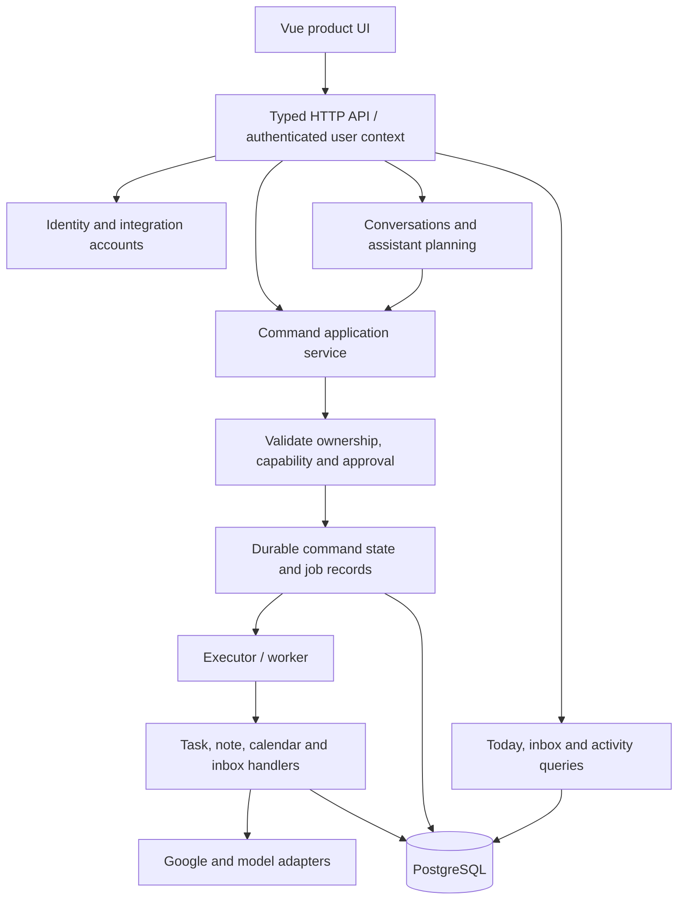

# Jarvis professional rework and private-beta launch plan

Date: 21 September 2026 · Based on the [repository audit](/Users/celian/Documents/jarvis-ai/docs/2026-09-21-codebase-audit.md).

## Product outcome

Deliver a trustworthy personal assistant that helps an individual understand today's priorities, process their inbox, manage tasks and calendar events, and review what the assistant actually did.

The owner confirmed a **private beta for individual users**. Working assumptions for planning: a small invite-only cohort, one account per person, Google as the first integration, a web-first product, and French as the first complete interface language because most existing flows are French. Cohort size, commercial model, retention periods and operating budget remain product decisions; they do not block the foundational work.

Keep the current stack. Rework behavior behind stable boundaries and ship complete vertical slices. Avoid a big-bang rewrite, microservices, a framework migration, or broadening the feature list before validating the core experience.

## Beta scope

| Ship and finish | Limit or defer |
|---|---|
| Invite/login/logout; secure account ownership | Teams, shared workspaces, roles beyond the beta's operational needs |
| Guided Google connection, reconnection and disconnection | Additional email/calendar providers |
| Today: upcoming calendar, open tasks, pending actions | Large analytics dashboard and predictive metrics |
| Inbox scan, message review, archive/read/trash, draft and explicitly reviewed send | Permanent email deletion and unreviewed automated sending |
| Tasks and notes with direct controls and optional chat commands | Finance, habits, delegation, resource allocation and complex goal hierarchies |
| Assistant conversation history and consistent confirmation | General autonomous multi-step agents |
| Activity history with failures, partial success and unknown outcomes | Broad undo promises for irreversible external actions |
| Personal settings, privacy/export/delete, clear support path | User-editable API URLs, tokens and identity IDs |
| Reminders only if delivery and recovery are complete | Recurrence without a tested scheduling/delivery model |

Web retrieval remains disabled until outbound network security is verified. Local calendar fallback should be hidden in the hosted beta unless it becomes an explicit, fully supported product mode. Hide deferred capabilities in server policy and prompts as well as navigation; hiding a screen does not disable a tool.

## Target architecture

Use a **modular monolith** with one API, one database, and a worker process only for durable jobs that need it. Start with a durable PostgreSQL-backed job/command design or a justified maintained queue; do not introduce Redis solely for hypothetical scale.



Boundaries and contracts:

- **Identity:** user IDs come from verified server sessions. Conversation IDs never authenticate a user. Prefer a mature authentication implementation with secure HttpOnly cookies and an explicit CSRF/origin strategy, rather than custom token cryptography.
- **Domain records:** every private record has an owner. Prefer direct user ownership for this individual-user beta; add organizations only when a real use case requires them.
- **Commands:** both UI and chat call the same validated application service. A command contains owner, stable request ID, tool/version, validated arguments, immutable target snapshot, approval, status and timestamps.
- **Tool definitions:** one explicit definition per tool for schema, risk, capability requirements, preview and execution. Derive planner descriptions and API contracts from these definitions where practical. Keep domain handlers independently testable.
- **Assistant:** proposes structured actions; deterministic code checks ownership, capabilities, argument validity and approvals. Model prose does not establish that an action succeeded.
- **Provider adapters:** injected implementations, bounded deadlines, quota handling, typed errors and explicit distinction between retryable failure and unknown outcome.
- **Query models:** fetch Today/Activity without invoking an LLM. Represent stale/unavailable integrations explicitly; avoid expensive provider reads on every route change.
- **Operational state:** durable conversation and command history. Caches may accelerate reads but cannot be the sole source for approvals, undo or in-flight work.

## Delivery phases and acceptance criteria

Effort below is a planning range in focused engineering days, not a promised calendar schedule. Estimates assume one experienced full-time engineer, narrow scope, access to test accounts/infrastructure, and timely product decisions. Design research and external verification can extend elapsed time.

### Phase 0 — Establish a reproducible baseline and contain immediate risks

**Effort:** 3–5 days. **Dependencies:** none. **Audit:** A02, A03, A07, A11.

1. Replace starter setup guidance with project-specific setup, supported Node/package manager versions, environment configuration and Prisma generation/migration steps.
2. Add non-mutating check commands and CI for both applications: install from lockfiles, generate client, typecheck, build, lint and tests.
3. Investigate the two failing calendar tests; determine whether routing or stale expectations are wrong using focused behavior tests. Do not remove assertions to make the suite green.
4. Record existing lint debt; prevent new debt immediately and reduce unsafe typing in touched modules. Separate mechanical cleanup from behavior changes. Reach zero lint errors in the shipped surface before launch.
5. Fix assistant/OAuth HTML rendering; disable unsafe web retrieval until hardened. Restrict development assets to development configuration.
6. Add an isolated PostgreSQL test environment and fake provider adapters. Ensure no CI test can send real email or mutate a real calendar.

**Exit:** clean-checkout build/typecheck/test passes; CI reproduces it; XSS probes fail safely; unsafe retrieval is blocked or disabled; developer pages are inaccessible in production configuration. Advisory status is explicitly unresolved until the external check is authorized and completed.

### Phase 1 — Identity, ownership and integration security

**Effort:** 5–8 days. **Dependencies:** Phase 0 containment and test harness. **Audit:** A01, A05, A06, A07.

1. Implement invite-only access and verified account sessions; protect every private API and integration route by default.
2. Add User, authentication session and integration-account ownership; split conversation identity from account identity.
3. Add owner columns, relations and useful owner/query indexes to retained data. Scope all mutations, lists, aggregate counts, search, previews and cached references to the authenticated user.
4. Use an expand/backfill/verify/contract migration: back up first, map known legacy ownership explicitly, quarantine ambiguous rows, verify counts and isolation, then enforce non-null constraints. Never expose orphaned records to all users.
5. Bind OAuth initiation/callback to a signed-in account, persist single-use expiring state, encrypt tokens, and support reconnect, revocation and account deletion. Google account linking must not silently replace another account's integration.
6. Validate startup configuration, origins, request sizes, quotas and production-only behavior. Remove editable user identity/API tokens from the product settings.

**Exit:** unauthenticated requests fail; user A cannot read, search, count, mutate, confirm or delete user B's data, even with known IDs. Fresh-database and legacy migration rehearsals pass on disposable data. OAuth survives expected restarts; token material is absent from logs and browser storage.

### Phase 2 — One reliable execution system

**Effort:** 6–10 days. **Dependencies:** Phase 1 ownership model. **Audit:** A04, A05, A08.

1. Introduce the command journal and explicit state machine; preserve immutable arguments and approval targets.
2. Atomically claim commands with owner/status/expiry predicates. Make replay return command state rather than execute again.
3. Route Inbox Zero and chat through the same policy/executor. Apply simulation, capability gates and audits consistently.
4. Persist per-step provider references and per-item batch outcomes. Separate sending from follow-up label changes so a label failure cannot turn a successful send into a retryable send.
5. Represent unknown outcomes explicitly. Reconcile before any retry; never promise exactly-once execution when the external provider cannot guarantee it.
6. Revalidate targets and permissions at execution. Support cancellation before execution, and explain when a command has already run. Treat undo as a supported compensation per command type.
7. Add failure injection around timeout, database failure, duplicate submission, concurrent confirmation, revoked access, restart and post-send failure.

**Exit:** repeated or concurrent confirmations do not repeat a completed effect; a simulated crash does not lose approved work; partial successes are visible; unknown sends never auto-retry; simulation produces no real provider mutations. Test this with fake providers and a disposable database before exercising dedicated test accounts.

### Phase 3 — Restructure around retained domains and explicit contracts

**Effort:** 5–8 days. **Dependencies:** phases 1–2 contracts; small extractions can happen during them. **Audit:** A10, A11, A12.

1. Extract planning, policy, execution, conversation storage and presentation from JarvisService. Move tool handlers out of the global switch by domain.
2. Inject LLM/web/weather providers using the same pattern already used for Google providers. Consolidate validated configuration.
3. Define versioned request/response/error contracts; generate or share frontend types and validate untrusted model/provider inputs at runtime.
4. Replace broad catches with typed not-found/validation/unavailable/outcome-unknown results. Stop representing database failures as empty lists.
5. Persist conversations and any user-visible references that must survive a restart; bound caches and remove correctness dependence on process-global state.
6. Improve query shapes and indexes for retained domains. Add pagination, bounded batch sizes and clear freshness metadata. Fix literal search handling.
7. Disable deferred tools and stop advertising them to the model. Preserve legacy data until migration/export requirements are settled.

**Exit:** each retained tool has a schema, owner checks, policy, deterministic tests and injected providers; frontend/server contracts agree; restart tests preserve history and pending operations; changing a handler does not require editing unrelated domain logic.

### Phase 4 — Rebuild the product experience

**Effort:** 6–10 days including implementation; design discovery can start during Phase 1. **Dependencies:** stable identity/command/API contracts for integration. **Audit:** A08, A09, A10.

1. Define and prototype five primary areas: **Today**, **Inbox**, **Assistant**, **Activity**, **Settings**. Validate the primary flows with a few representative beta users before polishing all screens.
2. Design onboarding: accept invitation → sign in → understand Google access → connect → select timezone/preferences → complete one useful action. Users must be able to understand what works without Google.
3. Replace technical settings and mixed-language copy with account, preferences, connections, privacy and support. Establish reusable typography, spacing, color, focus and state conventions using existing UI primitives where appropriate.
4. Make Today actionable: actual tasks/events, useful next action, freshness and unavailable states. Add direct task/note editing that does not depend on natural-language parsing.
5. Make Inbox a focused review workflow with clear selection, recipients/draft preview, reversible cleanup and honest per-item results. Defer permanent deletion.
6. Add persistent chat history and structured action cards. Fix cancellation/signal propagation and ignore stale responses after navigation/account changes. Add streaming only after command semantics are sound.
7. Add Activity with pending/completed/failed/unknown actions and supported recovery. Success copy must come from the command result.
8. Specify and test empty/loading/offline/disconnected/expired/permission-denied/partial-failure states. Use persistent page messages for blocking failures and concise, deduplicated toasts for transient feedback.
9. Verify keyboard use, focus restoration, dialogs, readable contrast, screen-reader labels, reduced motion, and representative mobile/tablet/desktop widths.

**Exit:** a new user completes onboarding and a useful action without developer assistance; refresh preserves history; UI never confuses unknown data with an empty account; each critical workflow has a browser test and a keyboard walkthrough. The visual direction is demonstrated with working states, not only static mockups.

### Phase 5 — AI quality, privacy, delivery and operational readiness

**Effort:** 5–8 days. **Dependencies:** core flows from phases 2–4; provider-verification work begins in Phase 0. **Audit:** A03, A06, A07, A10.

1. Build a versioned evaluation set for French intent routing, ambiguous requests, dates/timezones, missing permissions, destructive commands, malformed tool output and untrusted email/web instructions. Add real beta failures as regression cases using consented/redacted fixtures.
2. Enforce model deadlines, output/token budgets, per-user quotas and a global spend ceiling. Track tokens, calls, fallback rates, latency and estimated cost per successful user workflow; establish actual budgets from measurements.
3. Keep retrieved content separate from user authorization. Test prompt-injection attempts against policy boundaries and destination/argument checks.
4. Harden web retrieval before enabling it, with address/redirect/body/deadline/egress tests.
5. If reminders ship, add a durable delivery worker, retries with safe deduplication, timezone-aware recurrence, overdue handling and channel consent/preferences. Otherwise remove reminder-delivery promises from the release.
6. Add redacted error reporting, correlation IDs, provider-failure metrics, queue age, readiness and alerts. Separate operational telemetry from sensitive user-visible activity history.
7. Implement export/deletion/retention controls and document data flows to Google/model providers. Confirm applicable Google verification or beta exceptions; external approval timing is not part of the engineering estimate.
8. Produce versioned deployment artifacts, migration procedures, staging smoke tests, backup/restore rehearsal, rollback instructions, and a switch to disable external mutations quickly.

**Exit:** safety-critical evaluation cases all pass; quotas fail safely; dashboards identify a failing command without exposing private content; export/delete and restore are rehearsed; provider access is approved for the actual cohort; support and incident response have an owner.

### Phase 6 — Controlled private beta

**Effort:** 3–5 engineering days for release preparation, then at least two weeks of observation. **Dependencies:** all applicable gates below.

1. Start with a proposed 5–10 invited users; expand only after reviewing reliability and support load. This cohort size is a recommendation, not an agreed limit.
2. Provide a feedback channel, known limitations, supported use cases and a simple way to disconnect/delete an account.
3. Measure onboarding completion, time to first useful action, core workflow completion, action failures/unknown outcomes, latency, per-user cost and repeat use. Agree retention/activation targets after observing initial behavior.
4. Review failure patterns, not just feature requests. Stop expansion for any data isolation failure, unexplained duplicate effect or unresolved sensitive-data exposure.

**Exit:** the cohort can repeatedly complete the supported workflows, operations are recoverable, and evidence supports expanding access. A private beta is the start of product validation, not proof of public-launch readiness.

## Critical path and effort

```text
Baseline/containment → identity/ownership → reliable commands → domain/contracts
                                                     ↓
                        product flows → operational gates → private beta
```

Design research, privacy requirements and Google verification preparation can proceed while foundations are built. Implementation integration follows the dependency order. The phase ranges total **33–54 focused engineering days**, roughly **7–11 working weeks for one engineer**, plus beta observation and external waits. Re-estimate after Phase 1 based on legacy-data complexity, authentication choice and product validation; do not commit a date from this audit alone.

## First implementation batch

Keep these reviewable and independently verifiable:

| Batch | Deliverable | Proof |
|---|---|---|
| 1 | Setup/check commands, explicit Prisma generation and CI baseline | Clean checkout builds; two failing tests explained and resolved |
| 2 | Safe Markdown/OAuth return page; unsafe retrieval disabled; dev assets gated | Attack fixtures cannot become executable markup; production config hides developer surface |
| 3 | Identity model, guarded API and invite flow | Unauthenticated requests denied; logout/session expiry tests |
| 4 | Ownership migration and scoped repositories/services | Two-user isolation, legacy mapping and restoration rehearsal |
| 5 | Authenticated/encrypted Google linking | Reconnect/revoke/callback ownership tests using dedicated test accounts |
| 6 | Durable command/confirmation lifecycle | Concurrent/replayed request and crash-recovery tests |
| 7 | Inbox execution through command pipeline | Send succeeds + label fails does not cause a second send on retry |

Do not mix the whole visual redesign into the ownership migration. Preserve and migrate current data deliberately. New schema changes should remain backward compatible during deployment whenever practical; document any step that requires an outage or forward repair instead of pretending every database migration is trivially reversible.

## Launch gate checklist

All applicable gates must have evidence, an owner and a recorded result before external invitations:

- [ ] Every private endpoint authenticates, and cross-user read/write/search/count/confirmation tests pass.
- [ ] Unsafe HTML, URL protocols, internal-network access and hostile response-size/deadline tests pass, or the corresponding feature remains disabled.
- [ ] OAuth ownership, expiration, revocation, encrypted token storage and secret redaction are verified.
- [ ] No duplicate external effect in repeated/concurrent submission tests; unknown-outcome actions have a safe recovery path.
- [ ] Simulation and capability controls are enforced across every execution entry point.
- [ ] Typecheck, build, lint and required tests pass in CI; migration replay works on a fresh database and a legacy fixture.
- [ ] Dependency vulnerabilities have been checked and triaged; any accepted risk is explicit and justified.
- [ ] Onboarding, inbox, task/calendar actions, history, cancellation and failure recovery pass browser tests.
- [ ] Keyboard, screen-reader smoke checks and representative narrow-screen layouts pass; contrast is measured.
- [ ] Data export/delete/retention and provider-access requirements are verified for this cohort.
- [ ] Quotas, monitoring, support, backups, restore, rollout and rollback are rehearsed.
- [ ] The shipped capabilities match the product's claims; unfinished/deferred tools are disabled server-side.

## Open decisions, not reasons to stop foundational work

Choose the authentication provider, hosting region and budget before Phase 1 implementation is finalized. Set cohort size, launch language and reminder delivery channel during Phase 0 product framing. Choose concrete data-retention periods and beta success metrics before invitations. Determine whether Google restricted-scope verification/assessment applies to the intended beta distribution with the actual provider configuration.

The dependency advisory check remains the only audit action specifically blocked by automatic approval review: it would disclose dependency names/versions to the npm registry. No clean-vulnerability claim is made until that check is authorized and run.
